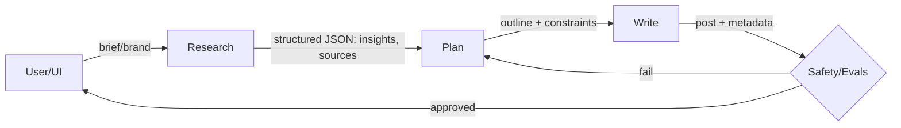

# OpenAI Production Blueprint for Multi-Agent Systems
## Comprehensive 2025 Best Practices for LinkedIn Content Generation

**Source**: OpenAI ChatGPT Research Response
**Date**: 2025-10-21
**Context**: Production-ready patterns for Next.js/TypeScript + PostgreSQL stack

---

## Executive Summary

This document provides a production-minded blueprint answering our key research questions with current (2025) best practices, concrete patterns, and pragmatic code for a Next.js/TypeScript + Postgres stack.

**Key Recommendations**:
- **Primary Framework**: LangGraph or OpenAI Agents SDK
- **Streaming**: Vercel AI SDK with SSE
- **Providers**: OpenRouter for intelligent routing with fallbacks
- **State**: PostgreSQL + pgvector for durable memory, Redis for sessions
- **Observability**: OpenTelemetry + Langfuse for tracing and cost tracking

---

## 1. Agent Architecture & Design Patterns (2025)

### Modern Patterns to Prefer

#### Graph-Based Orchestration (Deterministic, Inspectable)

**LangGraph** for stateful, checkpointed agent flows with short/long-term memory, guarded transitions, and resumability. It treats each node as a tool/agent and the **shared state** as first-class; it also ships thread-scoped checkpoints for persistence.

**Source**: [LangGraph Memory Management](https://langchain-ai.github.io/langgraph/concepts/memory/)

#### Lightweight Agent SDKs

**OpenAI Agents SDK** (prod-ready successor to "Swarm"): tiny set of primitives for tools, multi-step flows, and handoffs; integrates with OpenTelemetry/third-party tracing (Langfuse). Node support is rolling out.

**Source**: [OpenAI New Tools for Building Agents](https://openai.com/index/new-tools-for-building-agents/)

#### Crew Pattern (Role-Based Collaboration)

**CrewAI** provides role/task abstractions, flows, HITL checkpoints, tracing hooks. Useful when you want explicit "producer/consumer" roles with memory/guardrails baked in.

**Source**: [CrewAI Documentation](https://docs.crewai.com/)

#### Semantic Kernel (Microsoft)

For plugin-style tool binding and model-agnostic orchestration in .NET/TS shops. Planners evolved to rely on **native function calling** across vendors (OpenAI, Gemini, Claude, Mistral).

**Source**: [Semantic Kernel Documentation](https://learn.microsoft.com/en-us/semantic-kernel/)

### State Management Approaches

**Short-term (thread/session) memory** in the orchestration layer (e.g., LangGraph state + checkpointer) to hold message history, retrieved docs, intermediate artifacts; durable via Postgres or KV.

**Long-term memory split**:
- **Vector memory** (pgvector in Postgres) for semantic recall
- **Relational memory** (Postgres) for brand prefs, content rules, evals, costs, prospect db
- **Ephemeral memory** (Redis) for user session + rate counters, streaming cursors

### Inter-Agent Communication

**Shared state** in the graph (preferred), typed schemas passed node-to-node; prune state channels as you go to manage context windows.

**Message queues** for cross-service boundaries / long jobs: BullMQ (Redis) for Node stacks or **Temporal** for durable workflows and retries with compensations.

**MCP (Model Context Protocol)** or plugin registries when tools are distributed across services.

**Source**: [OpenTelemetry AI Agent Semantic Conventions](https://github.com/open-telemetry/semantic-conventions/issues/1530)

### Error Handling & Fallback

Tool calls wrapped with **idempotency keys** and **exponential backoff with jitter**; mark transient vs. permanent errors; escalate to fallback model/provider; emit OpenTelemetry spans for each retry.

**OWASP LLM Top 10** mitigations for prompt injection & output handling (sanitize HTML, encode, never run LLM-produced code without a sandbox).

**Sources**:
- [Designing Idempotent APIs](https://medium.com/@shbhggrwl/designing-idempotent-apis-patterns-gotchas-and-real-life-scenarios-daa68adc1126)
- [OWASP Top 10 for LLMs](https://owasp.org/www-project-top-10-for-large-language-model-applications/)

---

## 2. Orchestration for Research→Plan→Write Pipeline

### Recommended Topology



### 1) Passing Data Between Agents

**Within one service**: Pass a typed **state object** (e.g., Zod schema) inside a LangGraph or Agents SDK run; store artifacts (links, embeddings, drafts) in Postgres and reference by IDs (keep contexts small).

**Across services or long tasks**: Publish **job IDs** to BullMQ or Temporal; agents fetch inputs by ID from Postgres/Redis.

### 2) Sequencing

- **Sequential by default**: Research → Plan → Write
- **Parallelize sub-steps** in Research (trend feeds, competitor scrape, SERP analysis) and **join** results before Planning

### 3) Conditional Branching

Guard rails: if Research returns low confidence or empty, **Plan** falls back to "brand topic defaults" + evergreen ideas; emit a warning to the UI.

### 4) Cost Optimization

Cache SERP, topic clusters, and competitor feeds in Postgres/Redis; store normalized "research snapshots" keyed by date/topic; use cheaper models for scraping/summarizing; reserve top models for the final Writing/critique turn. **OpenRouter** can route by price/perf and enforce zero-data-retention.

**Source**: [OpenRouter Provider Routing](https://openrouter.ai/docs/features/provider-routing)

### 5) Streaming to User

Use **Vercel AI SDK** `streamText()` or SSE endpoints in Next.js `app/api/.../route.ts`; send chunked deltas and progress events ("research 3/5 complete").

**Source**: [AI SDK streamText](https://ai-sdk.dev/docs/reference/ai-sdk-core/stream-text)

### Minimal TypeScript Skeleton (Next.js Route Handler)

```typescript
// app/api/pipeline/route.ts
import { streamText } from 'ai'
import { openai } from '@ai-sdk/openai'

export async function POST(req: Request) {
  const { briefId } = await req.json()

  // 1) Kick off parallel research sub-tasks (cached)
  // 2) Compose planning prompt with brand voice from Postgres
  // 3) Stream writing output to client
  const { textStream } = streamText({
    model: openai('gpt-4o-mini'),
    messages: [
      { role: 'system', content: 'You are a LinkedIn ghostwriter...' },
      { role: 'user', content: `Using brief ${briefId}, output a final LinkedIn post.` }
    ]
  })

  return new Response(textStream.toAIStream(), {
    headers: { 'Content-Type': 'text/event-stream' }
  })
}
```

---

## 3. External Communication & Tool Use

### Prospect Discovery (Be Compliant)

Prefer **LinkedIn Marketing Developer Platform** and partner APIs when you need reliable access; scraping generally **violates LinkedIn terms**. If you must enrich outside LinkedIn, use 3P providers (Proxycurl, etc.) and store only permitted fields.

**Sources**:
- [LinkedIn API Terms of Use](https://www.linkedin.com/legal/l/api-terms-of-use)
- [LinkedIn Marketing Developer Platform](https://learn.microsoft.com/en-us/linkedin/marketing/integrations/marketing-integrations-overview)
- [LinkedIn Limits 2025](https://phantombuster.com/blog/social-selling/linkedin-limits/)

### Tool-Use Patterns

Use **model function calling/tools** when you want the model to decide *when* to call (OpenAI tools, Anthropic tool use, Gemini function calls). Use **direct API calls** from your code when the call is deterministic and doesn't need model routing.

**Rate limits**: Centralize provider adapters with backoff + concurrency gates; record 429s and implement **randomized exponential backoff**; use **idempotency keys** for mutating endpoints.

**Caching**: Cache SERPs/resolved URLs, normalized profiles, and embeddings; set TTL based on data volatility.

### Async Operations

Long jobs (enrichment, graphs, bulk outreach): **queue** (BullMQ/Redis) + **webhooks** to update the UI; for long-running, stateful flows use **Temporal** and surface stepwise status to the client via SSE.

**Source**: [Server-Sent Events MDN](https://developer.mozilla.org/en-US/docs/Web/API/Server-sent_events/Using_server-sent_events)

---

## 4. State Management & Memory

### Short-Term (Per Generation)

Conversation + intermediate JSON in **LangGraph state** with **checkpoints**; prune channels after node completion to keep state lean.

### Long-Term (Product Memory)

**Postgres tables**:
- `brand_guideline`
- `tone_rule`
- `posting_history`
- `prospect`
- `engagement`
- `ab_test`
- `cost_event`

**pgvector** collections for reusable snippets, brand style exemplars, and audience pain points; attach per-brand embeddings.

**Redis** for session cursors, streaming buffers, and rate counters.

### Context Window Tactics

Retrieve **only** relevant chunks via vector search; **summarize** prior campaigns; inject **selectors** (brand rules, topic constraints) not raw history; rely on **Claude/Gemini long context** when you truly need more history, but prefer retrieval.

---

## 5. Multi-Provider Strategy

### Abstraction

Define a **unified interface**: `generate(params)`, `embed(params)`, `tools(...)`. Normalize system prompt location, tool schema, response shape.

For routing, **OpenRouter** can load-balance by price/throughput, enforce zero-data-retention, and define **fallback orders** per request.

**Source**: [OpenRouter Provider Routing](https://openrouter.ai/docs/features/provider-routing)

### Intelligent Routing

Map tasks → models: cheaper "research/summarize"; premium "write/final polish"; gate by latency/budget caps. Track **per-provider perf & cost** via Langfuse/Braintrust.

**Source**: [Langfuse Token and Cost Tracking](https://langfuse.com/docs/observability/features/token-and-cost-tracking)

### Provider-Specific Optimizations

- **OpenAI**: Robust **function calling** + structured output; strong tool ecosystem
- **Anthropic**: Very long context windows & reliable tool use
- **Google Gemini**: Multimodal & function calling; good for image-aware posts
- **OpenRouter**: Request-level provider ordering, price-based LB, ZDR enforcement

---

## 6. Production Considerations

### Monitoring & Observability

Adopt **OpenTelemetry GenAI** semantic conventions; trace each agent step, tool call, retries, tokens, and cost; export to Langfuse for rich traces, evals, and cost dashboards.

**Source**: [OpenTelemetry GenAI Semantic Conventions](https://opentelemetry.io/docs/specs/semconv/gen-ai/)

### Scalability

Concurrency controls + queues; **DB pooling** (pgBouncer); **server-side cache** for embeddings & SERPs; **SSE** for low-overhead streaming at scale.

### Security

Central **secret management**; per-tenant data isolation at DB level; **prompt-injection defenses** (content filters, tool whitelists, schema validation, never blindly execute LLM output); **sanitize HTML** prior to render.

**Source**: [OWASP LLM Top 10](https://owasp.org/www-project-top-10-for-large-language-model-applications/)

### UX

Stream "Research ▢▢▢▢▢ 3/5" and partial drafts via SSE/AI SDK; implement "Cancel" that cancels queued work; run **A/B post variants** and capture engagement metrics for model selection.

---

## 7. Framework Comparison (2025 Snapshot)

### LangChain/LangGraph
**Use cases**: Stateful, inspectable, multi-agent graphs with memory/checkpointing
**Production**: Mature; v1 focuses on state & memory
**Learning curve**: Moderate (graphs + state)

**Source**: [LangGraph Low Level Concepts](https://langchain-ai.github.io/langgraph/concepts/low_level/)

### Microsoft Semantic Kernel
**Plugin architecture** + model-agnostic; .NET/TS support; good when you want Azure ecosystem & enterprise guardrails

### CrewAI
**Collaboration patterns** with roles/tasks/flows; observability & HITL options; Python-first. Great for role-driven division of labor.

### AutoGPT/BabyAGI
Researchy, autonomous loops; still finicky for production without a controlling graph; treat as inspiration not backbone.

### OpenAI "Swarm" → Agents SDK
Minimal abstractions, tool-centric, integrates well with modern tracing & evaluation; good when you want a **thin** layer over provider APIs.

**Source**: [OpenAI Agents Python SDK](https://github.com/openai/openai-agents-python)

### Custom
Build your own when you need absolute control over state, cost, or compliance. You'll re-implement: state store, retries, tool registry, tracing, evals.

### Recommendation for LinkedIn Generator

**Primary**: **LangGraph** (graph/state/memory) or **OpenAI Agents SDK** (thin, tool-centric) depending on how much structure you want. Use **Vercel AI SDK** for streaming UX; **OpenRouter** for provider routing.

---

## 8. Prompt Engineering for Specialized Agents

### Research Agent
- **Goal**: Factual, unbiased, deduped insights
- **Temp**: 0.0–0.3
- **Output**: Strict JSON (Zod-validated). Include source URLs + confidence

### Planning Agent
- **Goal**: Convert research → outline with brand voice
- **Temp**: 0.3–0.5
- **Output**: `{hook, thesis, 3-4 bullets, CTA, hashtags[], constraints[]}`

### Writing Agent
- **Goal**: A LinkedIn-ready post (≤ 2,800 chars), scannable, with line breaks, and a single, testable CTA
- **Temp**: 0.5–0.7
- **Output**: `{post_text, alt_text, suggested_image, variants[]}`

### Cross-Cutting Concerns

- **System prompts** hold invariants (brand safety, facts > flair)
- Provide **few-shot** exemplars for voice
- Prefer **structured outputs + self-critique loops** (critic tool) over exposing chain-of-thought
- Enforce with JSON schema + validators (reject + retry on invalid)

---

## Code & Schema Snippets (TypeScript)

### 1) Provider Router (OpenRouter)

```typescript
// lib/llm.ts
export const baseURL = 'https://openrouter.ai/api/v1/chat/completions'

export async function chat({
  messages,
  maxPriceUsd
}: {
  messages: any[]
  maxPriceUsd?: number
}) {
  const body = {
    model: 'openai/gpt-4o-mini',
    messages,
    provider: {
      order: ['openai', 'anthropic'],   // prefer OpenAI, fallback to Anthropic
      allow_fallbacks: true,
      sort: 'price',
      max_price: { prompt: maxPriceUsd ?? 0.002 } // cap per 1K tokens
    }
  }

  const res = await fetch(baseURL, {
    method: 'POST',
    headers: {
      'Authorization': `Bearer ${process.env.OPENROUTER_API_KEY}`,
      'Content-Type': 'application/json'
    },
    body: JSON.stringify(body)
  })

  return res.json()
}
```

### 2) Research → Plan Handoff (Typed)

```typescript
// types/pipeline.ts
import { z } from 'zod'

export const ResearchResult = z.object({
  topic: z.string(),
  summary: z.string(),
  insights: z.array(z.object({
    point: z.string(),
    whyItMatters: z.string(),
    source: z.string().url()
  })),
  competitors: z.array(z.object({
    name: z.string(),
    url: z.string().url(),
    angle: z.string()
  }))
})
export type ResearchResult = z.infer<typeof ResearchResult>

export const PlanSpec = z.object({
  hook: z.string(),
  outline: z.array(z.string()),
  cta: z.string(),
  brandRules: z.array(z.string())
})
export type PlanSpec = z.infer<typeof PlanSpec>
```

### 3) Streaming Response via AI SDK

```typescript
// app/api/write/route.ts
import { streamText } from 'ai'
import { openai } from '@ai-sdk/openai'
import { NextRequest } from 'next/server'

export async function POST(req: NextRequest) {
  const plan = await req.json()

  const { textStream } = streamText({
    model: openai('gpt-4o-mini'),
    system: 'You are a professional LinkedIn ghostwriter...',
    prompt: `Plan JSON:\n${JSON.stringify(plan)}\n\nWrite a final post.`
  })

  return new Response(textStream.toAIStream(), {
    headers: { 'Content-Type': 'text/event-stream' }
  })
}
```

### 4) Observability (OpenTelemetry + Langfuse)

Instrument each agent/tool step; export traces, tokens, and costs; Langfuse has built-in cost tracking & Vercel AI SDK telemetry integration.

**Source**: [Langfuse Token and Cost Tracking](https://langfuse.com/docs/observability/features/token-and-cost-tracking)

---

## Data Model (Postgres Highlights)

```sql
-- Brand guidelines
CREATE TABLE brand_guideline (
  brand_id UUID PRIMARY KEY,
  rules JSONB NOT NULL,
  updated_at TIMESTAMPTZ DEFAULT NOW()
);

-- Research snapshots with vector embeddings
CREATE TABLE research_snapshot (
  id UUID PRIMARY KEY,
  topic VARCHAR(255) NOT NULL,
  snapshot_date DATE NOT NULL,
  data JSONB NOT NULL,
  embedding vector(1536)  -- pgvector
);

-- Content drafts
CREATE TABLE content_draft (
  id UUID PRIMARY KEY,
  brand_id UUID REFERENCES brand_guideline(brand_id),
  outline JSONB,
  post_text TEXT NOT NULL,
  model VARCHAR(100),
  cost_cents INTEGER,
  created_at TIMESTAMPTZ DEFAULT NOW()
);

-- Prospects
CREATE TABLE prospect (
  id UUID PRIMARY KEY,
  platform VARCHAR(50),
  handle VARCHAR(255),
  fields JSONB,
  last_seen_at TIMESTAMPTZ
);

-- Engagement metrics
CREATE TABLE engagement (
  post_id UUID REFERENCES content_draft(id),
  metric VARCHAR(50),
  value NUMERIC,
  captured_at TIMESTAMPTZ
);

-- A/B testing
CREATE TABLE ab_test (
  test_id UUID PRIMARY KEY,
  variant VARCHAR(50),
  post_id UUID REFERENCES content_draft(id),
  result JSONB
);
```

Use **pgvector** for `research_snapshot.embedding` & "voice exemplars."

---

## Security & Compliance Checklist

- ✅ Enforce **LinkedIn API terms** (avoid scraping; use approved endpoints/partners)
- ✅ **OWASP LLM Top 10** controls: input/output validation, tool allow-lists, HTML sanitization, PII redaction, rate limits, budget caps per tenant
- ✅ **Idempotency keys** for all mutating operations
- ✅ **Exponential backoff with jitter** for retries
- ✅ **Per-tenant data isolation** at database level
- ✅ **Secret management** (never commit API keys)
- ✅ **Prompt injection defenses** (content filters, schema validation)

---

## What to Pick for Your Build (TL;DR)

| Component | Choice | Rationale |
|-----------|--------|-----------|
| **Coordination** | LangGraph **or** OpenAI Agents SDK | LangGraph for complex state, Agents SDK for thin layer |
| **Streaming UX** | Vercel AI SDK `streamText()` + SSE | Best Next.js integration |
| **Providers** | OpenAI + Anthropic + Gemini via **OpenRouter** | Price-based routing, ZDR, fallbacks |
| **State** | PostgreSQL + pgvector + Redis | Durable memory + semantic search + sessions |
| **Queues** | BullMQ (Redis) | Node-friendly, consider Temporal later |
| **Obs/Evals/Cost** | OpenTelemetry GenAI + **Langfuse** | Built-in cost tracking, Vercel AI SDK integration |

---

## Minimal Repo Layout Suggestion

```
linkedin-accelerator/
├── app/
│   └── api/
│       ├── pipeline/route.ts       # Main orchestration endpoint
│       ├── research/route.ts       # Research agent
│       ├── plan/route.ts           # Planning agent
│       └── write/route.ts          # Writing agent (streaming)
├── lib/
│   ├── agents/
│   │   ├── research.ts
│   │   ├── planning.ts
│   │   └── writing.ts
│   ├── llm/
│   │   ├── providers.ts            # OpenRouter + provider abstraction
│   │   └── types.ts                # Zod schemas
│   ├── db/
│   │   ├── schema.sql
│   │   ├── migrations/
│   │   └── queries.ts
│   └── observability/
│       └── telemetry.ts            # OpenTelemetry + Langfuse
├── workers/
│   └── queue.ts                    # BullMQ workers
└── types/
    └── pipeline.ts                 # Shared TypeScript types
```

---

## References & Sources

1. [LangGraph Memory Management](https://langchain-ai.github.io/langgraph/concepts/memory/)
2. [OpenAI New Tools for Building Agents](https://openai.com/index/new-tools-for-building-agents/)
3. [CrewAI Documentation](https://docs.crewai.com/)
4. [Semantic Kernel Documentation](https://learn.microsoft.com/en-us/semantic-kernel/)
5. [OpenRouter Provider Routing](https://openrouter.ai/docs/features/provider-routing)
6. [AI SDK streamText](https://ai-sdk.dev/docs/reference/ai-sdk-core/stream-text)
7. [LinkedIn API Terms of Use](https://www.linkedin.com/legal/l/api-terms-of-use)
8. [LinkedIn Marketing Developer Platform](https://learn.microsoft.com/en-us/linkedin/marketing/integrations/marketing-integrations-overview)
9. [OpenTelemetry GenAI Semantic Conventions](https://opentelemetry.io/docs/specs/semconv/gen-ai/)
10. [Langfuse Token and Cost Tracking](https://langfuse.com/docs/observability/features/token-and-cost-tracking)
11. [OWASP Top 10 for LLMs](https://owasp.org/www-project-top-10-for-large-language-model-applications/)
12. [Server-Sent Events MDN](https://developer.mozilla.org/en-US/docs/Web/API/Server-sent_events/Using_server-sent_events)
13. [OpenAI Agents Python SDK](https://github.com/openai/openai-agents-python)
14. [LangGraph Low Level Concepts](https://langchain-ai.github.io/langgraph/concepts/low_level/)

---

**Last Updated**: 2025-10-21
**Status**: Production-Ready Blueprint
**Source**: OpenAI ChatGPT Research Response
